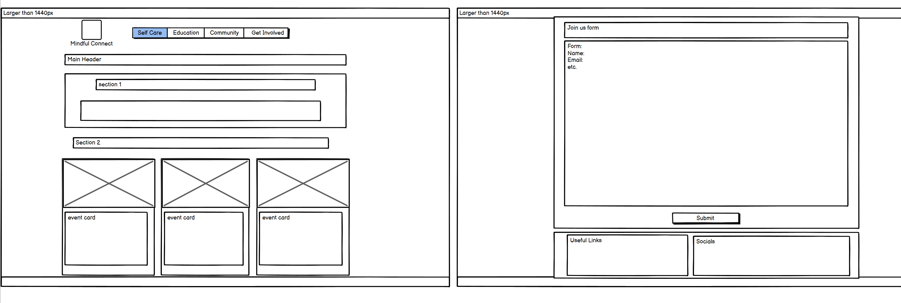

# Mindful Connect

**[Live Project](https://mfs4711.github.io/portfolio-project-1/)**

## Table of Contents

 1. [Overview](#overview)
     - [Purpose](#purpose)
     - [Target Audience](#target-audience)
 2. [User Stories](#user-stories)
     - [Must-Have User Stories](#must-have-user-stories)
     - [Should-Have User Stories](#should-have-user-stories)
     - [Could-Have User Stories](#could-have-user-stories)
 3. [Design Decisions](#design-decisions)
     - [Wireframes](#wireframes)
     - [Colours](#colours)
     - [Fonts](#fonts)
 4. [Features Implementation](#features-implementation)
     - [Core Features (Must-Haves)](#core-features-must-haves)
     - [Advanced Features (Should-Haves)](#advanced-features-should-haves)
     - [Optional Features (Could-Haves)](#advanced-features-should-haves)
 5. [AI Tools Usage](#ai-tools-usage)
     - [Github Copilot](#github-copilot)
     - [ChatGPT](#chatgpt)
 6. [Testing and Validation](#testing-and-validation)
     - [Testing Results](#testing-results)
     - [Validation](#validation)
 7. [Deployment](#deployment)
 8. [Reflection on Development Process](#reflection-on-development-process)
 9. [Code Attribution](#code-attribution)
 10. [Future Improvements](#future-improvements)

## Overview

### Purpose

Mindful Connect is a fictional organisation which aims to raise awareness about mental health and foster a supportive community for individuals seeking help or wanting to learn more about mental wellness.
This is achieved by providing organised webpages dedicated to different aspects of the purpose. 
There is a webpage dedicated to mental health information, providing an introduction to mental health issues and the actions a person can take to deal with this as well as the support available. There will be another webpage dedicated to weekly events and providing the option to join the community. Further to this, there is guidance towards wellness and self-care through the application of external links.

### Target Audience

The target audience for this project are individuals/groups looking to engage with others who are looking to further their knowledge into mental wellness. This is achieved as there is a beginners guide to mental health and there is an emphasis placed on joining the community and taking part in the events. The intended user does not need to be suffering from a mental health condition to find benefit in accessing the webpage, although this has been catered for, they can simply be wary of mental health being prevelant and looking at ways to ensure their's is kept on top of.

## User Stories

### Must-Have User Stories
- **User Story 1:** As a user, I can easily access resources related to various mental health topics So that I can learn about symptoms, treatment options, and coping strategies relevant to my needs.
  **Acceptance Criteria:** Clear guidance to resources section, a webpage clearly outlined with the information in a structured format and clear links for support
- **User Story 2:** As a user, I can be part of a supportive community So that I can feel less alone in my journey. 
  **Acceptance Criteria:** Encouragement for community events, both virtual and in-person

### Should-Have User Stories
- **User Story 1:** As a user, I can improve my mental wellness so that I can incorporate small, positive changes into my routine and stay motivated on my mental health journey. 
  **Acceptance Criteria:** An easy sign-up process for users, stress management techniques
- **User Story 2:** As a user, I can view a calendar of local support group meetings and mental health events, So that I can find opportunities to connect with others and access in-person resources. 
  **Acceptance Criteria:** Filters to find events based on specific topics (e.g., anxiety, depression) or demographics (e.g., teens, parents), Details about each event, including a description, how to join, and contact information for organizers.

### Could-Have User Stories
- **User Story 1:** As a user, I want personalized content recommendations based on my previous visits and interests, So that I can easily find relevant articles, resources, and tools that suit my needs. 
  **Acceptance Criteria:** A system that tracks user interactions and preferences to suggest tailored content, Regular updates to recommendations based on new content and user feedback.
- **User Story 2:** As a user looking for coping strategies, I want an interactive tool that helps me identify and practice different coping skills, So that I can find effective ways to manage my stress and emotions in real time.
  **Acceptance Criteria:** A user-friendly interface where users can select emotions or situations they’re facing. A variety of coping strategies presented, including mindfulness exercises, breathing techniques, and grounding activities.

## Design Decisions

### Wireframes
Include wireframes for key sections of your website.  
Briefly describe the design choices, including layout, colour schemes, and fonts.  
**Guidance:** Start this section during Phase 1: Ideation & Initial Setup and update it throughout Phase 2 and Phase 3. Include digital wireframes created in Phase 1. Document the reasoning behind your layout choices, colour schemes, and font selections.

In this section I will illustrate my initial intended layout through use of wireframes and outline why I chose the colours I did. The layout was constructed to make use of the space as the viewport grew up to a point, 1440px, and so the content appeared differently on mobiles compared to larger screens.

#### index.html (homepage)

##### Mobiles
On Mobile, the page should open showing the navbar displayed and the hero image with a quote on top of it. The Navbar will appear from a burger icon. As you scroll down the page the purpose paragraph would first show on a white background followed by the 6 Nav Cards which will be on top of a blue background. The Nav Cards would appear in a single file column. Below this there will be the upcoming event section, which will appear in a column with the event description and sign up button above the map iframe. This will be followed by the footer with links and socials which would appear one top of the other.

##### Tablets
On Tablets, the page will open with the hero image taking up a similar percentage of the viewport. The navbar will be expanded to show the webpage links. The purpose section appears next and following this the Nav Cards. As opposed to the mobile view, the tablet view will show the nav cards in two rows with three cards in each. Following this, the Upcoming Event heading would appear and below will be the event information on the left of the screen and the map to the right, so appearing in the same row. The footer will then be visible which will now show the footer items in a horizontal line across the width of the screen rather than stacked as they were on mobile.

##### Laptops
The layout will be identical to the tablet view, the content will just appear larger.

##### Screens over 1440px
On screens above 1440px the webpage will stop growing and just appear horizontally centered. There will be equal margins on both sides.

#### health-information.html

##### Mobiles
On Mobile, the page should open showing the navbar displayed followed by a main header for the page. Below this will be a short section introducing mental health followed by a section with a series of common mental health issues cards with links to external resources. These cards will appear in a single file column. The following section similarly consists of cards for managing stress and then a section for a card showing information about support options. There is another section of 3 cards in a clumn and a final paragraph block followed by the footer. On this page, there are no cards appearing side to side.

##### Tablets
On Tablets, the page will follow the same layout as above other than the layourt of the cards. These will appear in 2 rows of 3, so 6 in total, for sections 2 and 3. For section 4, there will be a single large card spanning the width of the container with a get help button. Below this there is one row of 3 cards with resource links. The final paragraph spans the width of the next section and the footer items appear in-line.

##### Laptops
The layout will be identical to the tablet view, the content will just appear larger.

##### Screens over 1440px
On screens above 1440px the webpage will stop growing and just appear horizontally centered. There will be equal margins on both sides.

#### health-information.html

##### Mobiles
On Mobile, the page should open showing the navbar displayed followed by a main header for the page. Below this will be a a section with 3 event cards appearing in a single file column. Below this is the section with a sign up form followed by the footer.

##### Tablets
On Tablets, the page will open with the navbar at the top followed by a single row of 3 cards for the events. This will be followed by a form which will have a slightly different layout to mobile to use the width of the container i.e. some form elements may now appear in the same row.

##### Laptops
The layout will be identical to the tablet view, the content will just appear larger.

##### Screens over 1440px
On screens above 1440px the webpage will stop growing and just appear horizontally centered. There will be equal margins on both sides.

### Colours
The colours used during the course of this project for both background and content have been chosen with both accessibility and the target user in mind. Research suggests that this website should have calm, pastel colours to provide a tranquil feeling to a user accessing the website as such blue, green, yellow and pink were the main suggestions. I also understood that there should be a clear contrast between the background and text appearing in front of it as well as there being a consistent colour layout to make it easier for the user to distinguish between different areas of the page. On this basis, the colours of this project were chosen and I will explain below how and why each colour was used.

##### Light Green - #B6F7BB
This was used for the background colour of the header and footer as it was considered a calming colour which allowed the content above to be viewed better.

##### Dark Blue - #1C5E84
This was used for one of the logo words of the logo which appears in the navbar. This provided good contrast from the green background and was used to provide a two toned nature to the logo.

##### Dark Purple - #170358
This was used for one of the logo words of the logo which appears in the navbar. This provided good contrast from the green background and was used to provide a two toned nature to the logo.

##### Light blue - #64C1F7
This was arguably the most common colour as it was used more most of the backgrounds. It provides a calm, sea-like enironment for content to sit on top. It does not catch the user's eye, as to take away from the content which is what the user's eyes should be drawn to.

##### yellow/gold -  #FFD61F
This was used like a banner to mark more current/active events and ideally would draw the user's attention. This is brighter than the other colours used to provide more emphasis for the reasons stated. This is used on the get involved paged and the evtn header at the bottom of the homepage.

##### Off-White - #fafafa
This was used predominantly as a background colour which signified the first and last section of the webpage, immediately after the header and immediately before the footer respectively. This was used as an indicator for users that they are approaching the end of the webpage and also contained useful information for the user to take away. This was also used as a description of the tiles on the health information page to provide a subtle hint that the tiles can be clicked.

##### Shade of Black - #191923
This was used as the font colour for the majority of the page. This provided excellent contrast from the backgraounds used, thus making the content readable. Prior to applying this colour, it was put through an accessibility checker which indicated it was good to use.

### Fonts
There were two fonts used for this project, Roboto and Lato. Lato was used for the headings where as Roboto was used for all other content. The reason for this was that Roboto is one of the most used fonts on the internet and provides a proffessional feel to the webpage. I did not want users to be focused on the font but rather the information and so I felt I should keep with the norm. Lato is a similar font to Roboto and so provides a subtle difference between heading and content.

### Accessibility Considerations
Discuss how accessibility guidelines were adhered to, including colour contrast and alt text for images.  
**Guidance:** Outline how you've incorporated accessibility into your design, ensuring that your project adheres to guidelines such as WCAG.

#### Colour Contrast
I ensured to adhere to accessibility guidelines by using the combinations of colours I picked. I used [Coolers Contrast Checker](https://coolors.co/contrast-checker/112a46-acc8e5) to examine the colours used during the project. A change in the logo was made after completing this check as the initial colour used didn't pass the contrast check. Below you will find the results of the various contrast checks I completed where I compared the background colour with the foreground content:

## Features Implementation

### Core Features (Must-Haves)
- **Feature 1:** Easy access to mental health information - There is a clear nav and descriptive cards which, when clicked, take the user to a webpage with a guide to mental health which is clearly structured in a logical way. There are also, some coping messages mentioned.
- **Feature 2:** Encouragement of community - clear guidance to ways to participate in various activities as well as external access to a community forum

### Advanced Features (Should-Haves)
- **Feature 1:** Improving mental wellness - This has been implemented by encouraging a 30 day self challenge as well as guided meditations. Also, the mental health information page suggests actions to help manage stress
- **Feature 2:** Calendar of events - partly implemented as on the get involved page there are multiple weekly events shown as well as a means to sign up to the community to be able to join future events.

### Optional Features (Could-Haves)
- **Feature 1:** personalised content - was not implented as such but there are multiple events
- **Feature 2:** interactive tool - not implemented as must have's and should have's were prioritised.

## AI Tools Usage

### GitHub Copilot

Github Copilot is a code completion and automatic programming tool which assists users by autocompleting code.
This has been particularly beneficial when styling with Bootstrap as there are many divs and it can be difficult to identify where these close.
The editor, with beautify/prettier added on, allows these opening and closing divs to be lined up more easily.
There were however some challenges experienced when copying repeated code to another area, i.e. for the card's. 
This is because a closing div, or closing tag of the first element, would appear on the first line automatically and these could be easily missed.
Therefore, using a validator after writing a block of code was essential to mitigate this and ensure the output appeared as desired.

### ChatGPT

ChatGPT was not used for any coding purpose but was a great aid in creation of this project.
First of all, it was used for brainstorming ideas and producing layout concepts.
Further to this, it was used to generate some of the content appearing on the health information page.
Challenges with this AI software included the need to ask the right questions as it can take the topic in an unintended direction, therefore, it was important to keep on top of this.

## Testing and Validation

### Testing Results

#### Bug Fixes
Testing of the project took place frequently to ensure any bugs could be dealt with at an early point. These bugs were first investigated using chrome developer tools and the fix put in place there before commiting it to the code.

- bug fix - burger icon appearing on new line in mobile view - add class on nav's surrounding div and remove padding
- bug fix - nav items not aligning on large screens - add flex class for larger screens to align nav items
- bug fix - nav items are not on the right - use bootstrap margin property to push nav items right
- bug fix - hero-image is not taking up the required viewport - Adjust size of background image to push purpose content further down
- bug fix - margin between cards and paragraph content is not even - remove bottom margin from paragraph element to make gap between purpose and cards even
- bug fix - forms are not entirely responsive - use form-row class to enclose form-group to allow form elements to appear on the same / different lines depending on the viewport
- bug fix - navbar is not sticking to the top of the screen - usee css to fix position and give high z-index
- bug-fix - first section of content is under the navbar at the top of the page - add class in css to add padding-top equivalent to the navbar height and apply to the first row class div to push the content down

#### Responsiveness

### Validation
Discuss the validation process for HTML and CSS using W3C and Jigsaw validators.  
Include the results of the validation process.  
**Guidance:** Document your use of W3C and Jigsaw validators to ensure your HTML and CSS meet web standards. Include any errors or warnings encountered and how they were resolved.

#### HTML Validation

HTML validation was achieved using the W3C Validator which ensured the code met web standards. I chose to validate numerous times during the project to ensure any errors or warnings could be resolved early in the process.
I will outline the errors / warnings encountered and how these were resolved in each html page.

##### Validation 1 
- Completed after navbar coding was added 
- No errors or warnings found 
- Project was deployed at this stage as a result of the above

##### Validation 2 
- Completed after footer, hero and purpose section were coded 
- No errors found but there was a warning regarding the 2 sections enclosing the hero and purpose sections respectively.
- Warning was regarding the sections not having a heading element enclosed anywhere
- Resolved by adding a h1 element as a section heading and applying the hidden-heading class which was styled in CSS to not display
- Validation showed no errors or warnings after making this change.

##### Validation 3
- Completed after navcards coding was added 
- No errors or warnings found

##### Validation 4
- Completed after adding all navcards and events info to index.html, and creating health-information.html - also adding common mental health conditions section
- Completed on the health info page
- Some errors were found
- The first error related to the file name of the OCD image as it included spaces
- Resolved by taking the spaces out of the image file and amending the file path in the image code
- The closing div was missing for two of the surrounding divs for the card decks relating to the bootstrap rows class
- Resolved by adding the closing divs
- Validation showed no errors or warnings after making this change.

##### Validation 5
- Completed on index.html immediately after validating the health info page
- No errors shown but 2 warnings were shown relating to the iframe
- The first related to the width on the iframe html being a percentage
- Resolved by removing the width attribute in the html and styling this in CSS instead
- Second warning was relating to the iframe section not having a heading
- Resolved by adding a h1 element as a section heading and applying the hidden-heading class which was styled in CSS to not display
- Validation showed no errors or warnings after making this change.

##### Validation 6
- Completed on health info page after adding the remaining section on the page
- One error was shown relating to the button element with the get help message as it was enclosed in an anchor tag
- Resolved by removing the button code and adding the role=button attribute to the anchor tag
- Validation showed no errors or warnings after making this change.

##### Validation 7
- completed on get-involved page
- errors shown relating to ids for modal forms not being unique
- warning regarding too many hyphens on comment
- Amended id's to make them unique and easier to read
- Removed additional hyphens from html comment 
- Validation showed no errors or warnings after making this change.

##### Validation 8
- completed on index.html page
- Amended modal id to make unique prior to validating - as error previously seen
- Validation showed no errors or warnings after making this change.

##### Validation 9
- Completed on index.html page after all webpages complete and accessibility check changes made
- error found relating to a missing closing span in the collapsible nav button
- Resolved by adding closing span
- Validation showed no errors or warnings after making this change.

##### Validation 10
- Completed on health info page
- No errors or warnings found

##### Validation 11
- Completed on get involved page
- No errors or warnings found

#### CSS Validation
CSS validation was achieved using the Jigsaw Validator which ensured the code met web standards. I chose to validate numerous times during the project to ensure any errors or warnings could be resolved early in the process.
I will outline the errors / warnings encountered and how these were resolved in each html page.

##### Validation 1 
- completed after navbar coding was added 
- no errors or warnings found 
- project was deployed at this stage as a result of the above

##### Validation 2 
- Completed after footer, hero and purpose section were coded
- No errors or warnings found

##### Validation 3
- Completed after navcards coding was added 
- No errors or warnings found

##### Validation 4
- Completed after adding all navcards and events info to index.html, and creating health-information.html - also adding common mental health conditions section
- No errors or warnings found 

##### Validation 5
- Completed after get-involved page was completed
- No errors or warnings found

##### Validation 6
- Completed after validating all html pages
- No errors or warnings found

## Deployment

### Deployment Process

The project was deployed early in the process to GitHub Pages to ensure any issues encountered could be resolved quickly.
Before deploying the project, I ensured to code a navbar to be able to see if the deployed project correlates with my preview.
The deployment process involved publishing my main branch and root directory which took a few minutes before completing.
The deployed project updated as required after each git push and few, if any, issues were encountered.

## Reflection on Development Process

### Final Thoughts

Through the course of completing this project I have been able to apply the skills learnt at Code Institute relating to HTML, CSS and Bootstrap in a way I perhaps previously would not have thought. I have found that although an original layout was created, this was iteratively changed as I found better solutions.

Overall, the project has hit the desired objective/brief which was to create a beginner friendly website for individuals who want to learn about common mental health issues and how to manage stress. I have gone above and beyond this by generating a community support type of organisation which encourages people to go a step further and embrace mindfulness and get involved in a range of activities both individual and group. Although, all the desired features could not be included, the project has been a success.

## Code Attribution

### Code Institute

To complete this project, I reflected and reviewed some previous walkthrough projects completed whilst learning to how to implement HTML, CSS and Bootstrap at Code Institute. To be specific for the inline key and value items in the events section at the bottom pf the homepage, I reflected on the [Love Rosie Bootstrap Walkthrough](https://github.com/MFS4711/love-rosie). I also, reviewed the [Love Running Walkthrough](https://github.com/MFS4711/love-running) to reflect on ways to make the navbar stick to the top of the screen. I also incorporated many aspects of [Bootstrap v4.6](https://getbootstrap.com/docs/4.6/getting-started/introduction/) such as implementing cards and providing form structure.

### Image sources
- [Google images](https://www.google.com/search?sca_esv=945b0f90c133864c&q=images&udm=2&fbs=AEQNm0Aa4sjWe7Rqy32pFwRj0UkWd8nbOJfsBGGB5IQQO6L3J_86uWOeqwdnV0yaSF-x2jon2iao6KWCaVjfn7ahz_sfz4kQc-hbvsXJ2gNx0RnV2nl305mvoek0YK94ylYY2a4b3Q-OEwW5lKppi2wujywZWmdIJVp8wrsv_g-eh5sWEDXx8JNpgmjsiKj2mZMvftPlZJZz&sa=X&ved=2ahUKEwjS5YTO9qOJAxV9WkEAHXerGu4QtKgLegQIEBAB&biw=1536&bih=695&dpr=1.25) was used for some of the card images
- [pexels](https://www.pexels.com/) was used as the source of the majority of images used on the page
- [unsplash](https://unsplash.com/) was used for the arts and crafts photo on the get-involved page

## Future Improvements

There is major scope for improvement for this project particularly relating to the could have user stories. This includes the unfinished webpages, mindefulness and community, which would have provided increased value on the website as it would further illustrate the ethos of the organisation, to provide mental health information but also act as a safe environment for all people to connect. These pages were not completed due to time constraints and it's lower priority compared to other aspects of the website.

Following the above, another improvement could be to make the page more interactive and react differently depending on the day of the week, so advertising a particular event. I currently don't possess the ability or knowledge to do this, and so this was not implemented.

There were also particular difficulties finding suitable artwork for this project and so, if this organisation were to be a reality, I would spend more time to either search for these further and refine the images or physically take them.